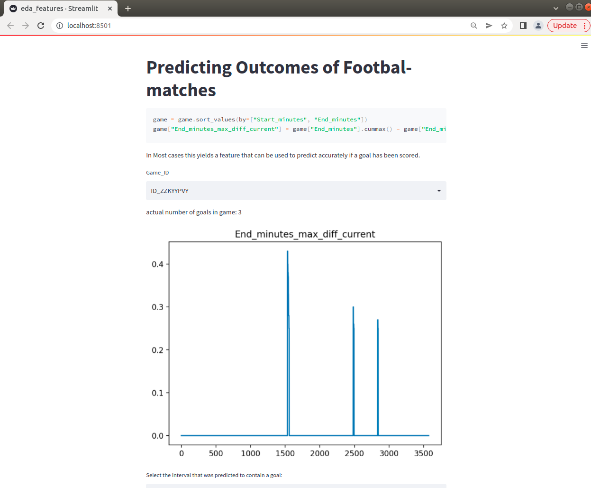
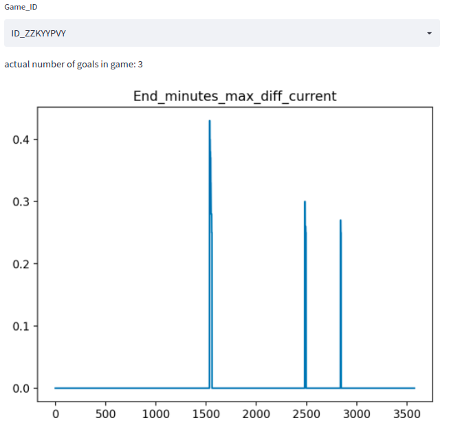
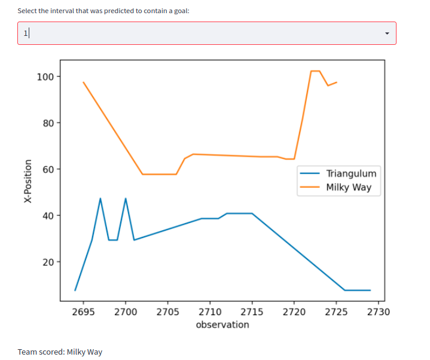
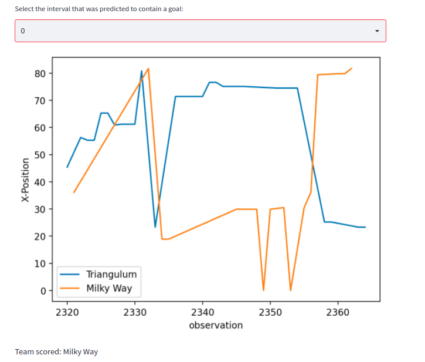

# Installation
```shell
conda create -n football python=3.9 -y
conda activate football
conda install --file requirements.txt -y
```

# Modelling
## Data
Copy all files into the directory **data**.

## Create Submission
```shell
python3 src/main.py
```
## Evaluation
```shell
python3 src/main.py --evaluate True
```

# EDA
```shell
 streamlit run src/eda_features.py
```


# Explanation of the approach
1. Predict the sequences in which goals are occuring.
Essentially the core observation is, time-intervalls in which goals occur are much longer.
    ```python
    game = game.sort_values(by=["Start_minutes", "End_minutes"])
    game["End_minutes_max_diff_current"] = game["End_minutes"].cummax() - game["End_minutes"]
    ```
    In Most cases this yields a feature that can be used to predict accurately if a goal has been scored.

    

    Using a simple thresholding-technique we can get an accuracy of ~ 99% on the train-set, where accuracy here means the number of games in which we accurately predict the number of goals.

2. Predict the team that has scored the goal. One key-feature here is the proximity to the goal. The closer we are to a goal the more likely it seems that the score has been made on that specific goal. The below plot shows an intervall in which a goal was scored. The X-axis is the observation, Y-axis is the X-Position of the observation. The generall Trend here is that the larger the X-Value the more likely it is that this team has scored.

   

   Allthough there are also more difficult examples:
   

    Simple methods like using the mean or median of the X-Position and predicting the team with the higher value as the attacker only gave an accuracy of ~ 70%.

    Hence I resorted to a ML-Approach. The features Team-Name and the  X,Y-Position for each observation in the time-intervall were used. All of these observations were concatenated in a single row, with a maximum set to 40 observations. This gave me 40*3 columns as features. For the target I noted the team that had scored. I generated the features and the target for all of intervalls that contained a goal. I then used a catboost-classifier to predict which team had scored the goal. The classifier reached a reasonable performance of 97% accuracy.

3. Predict the probability for home-win, draw and away-win. The catboost-model gives us for each goal that has been scored the  probabilities for each team. Simply using the max and predict that as the winner yielded a very poor score on the leaderboard. What worked better was performing monte-carlo-simulation. Essentially I did the following:
Given is a game a number of goals and a list of probabilities for the home-team to have scored each of the goals. I can use the binomial-distribution to simulate one trial essentially simulating if a goal has been scored or not. If the outcome of one trial is positive, home-team scores otherwise away-team. I can do this process for all goals. Doing this for all goals is one trial. At the end of the trial I can determine the outcome, home-win, draw or away win for that specific trial. This process is repeated 100_000 times and the mean is taken. This is the predicted probability.

4. Blend with a model that only takes as input the non-stats-part of the data. Credit goes to @Mkmworld as I took his Baseline Approach (publicly shared in the Discussions) for the blend.


# Final Words
Unfortunatelly I forgot to set the random-seed during submission and hence can not reproduce my submission 100%. I adjusted the code now so that from now on the submission should be reproducable.